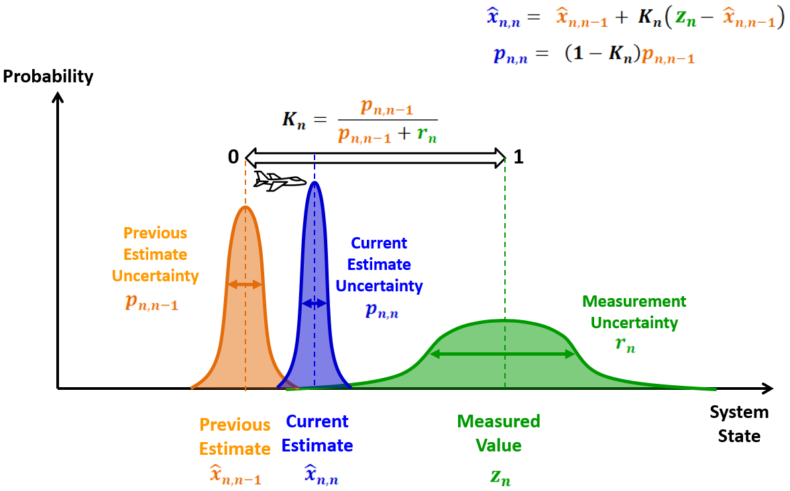
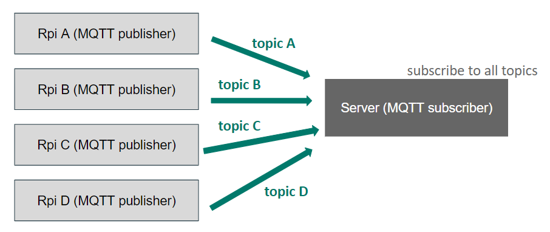

# Embedded Systems Lab Final Project - 夢想家園

 <i> Making interior decoration fun! </i> 

曾元 B07901163   林佩潁 B07901102   邵家澤 B07901081

Slides for our final presentation can be found [here](https://docs.google.com/presentation/d/1oxG7fQ4YjdOL_rXL2Y6k44hEikNMTCKHO84AEx_ngOA/edit?usp=sharing).

## Motivation
It's not a easy task for people to design the interior decoration. Traditional interior design model are usually accessed by mouses and keyboards. All the furnitures must be set up on the computer remotely, which may be less straightforward.... Thus, we want to provide a more interactive and straightforward way, so that the user can directly walk inside the new house and place the furniture at their wish. 

## Abstract
We use STM32 board and Raspberry Pis to create an interactive way for interior design. By setting up RSSI network, we can do the triangulation and find the user's location. The user can press the button on the STM32 board to trigger IRQ function for setting furniture. The STM32 board also supports accelerometer and magnetometer for motion and heading detection, which allows user to switch object and change facing direction. The user can walk around the room and place the furniture at anywhere he/she wants. We demonstrate our results with the Minecraft game engine.

## Technical Details

### 1. Interior Positioning System

Compared with outdoor localization, indoor localization requires much higher precision to be useful. In our case, we would like to differentiate between objects within 2-3 meters of each other, whichs rules out GPS or other outdoor localization methods.
After surveying several papers, we decided to try triangulation, using multiple RSSI measurements of a Bluetooth signal.
Our system consists of a STM32 board that advertises its signal, and 4 Raspberry Pis that detect the RSSI.

#### RSSI Distance Method
The received signal strength indication (RSSI) method is one of the common choices for interior positioning. The RSSI value represents the power of a received radio signal. The higher the RSSI value, the higher the signal strength. Moreover, since no additional sensors are required to measure RSSI values. It becomes our first choice.

RSSI distance method requires the received signal strength from the Bluetooth anchor points. The signal strength would decay as the distance between transmitter and receiver increase. Thus, we can build a decaying model and use the RSSI value to estimates the user’s distance respect to the anchor point. 

We use the mainstream logarithmic distance path-loss model to calculate the distance from the RSSI value. The mathematical decaying model is expressed as below. `d` is the distance between the transmitter and the receiver, and `n` is a decaying factor related to the specific wireless transmission environment. The initialization process is essential to find the decaying factor `n`. 

#### RSSI Variation
Our model assumes that the RSSI value is only dependent on the distance between the two devices. However, in reality, RSSI values are significantly influenced by the environment and noise caused by multi-path fading. There exist multiple reflection paths for the signal to transmit from the transmitter to the receiver, which may cause some interference so the actual received strength might be quite different from the ideal model. As a result, the variation of the received RSSI are unstable even in a well-controlled indoor scenario. Thus, some filter and post-processing is needed.

#### Kalman Filter
We adopt Kalman filter on both received RSSI value and the calculated distance to remove some noise and eliminate the large variation. The Kalman filter is a state estimator that makes an estimate based on noisy measurements. The key is that it takes the history values as well as the uncertainty of measurements into account. 

#### Triangulation
After we obtain the distance from each AP with known location, we can do the triangulation to find the coordinate of the user. We use `scipy.optimize` library to find the optimized coordinate and minimize the error.

#### MQTT
We use the MQTT messaging protocol for communications between Rpi and the server. MQTT is a publish-subscribe network protocol that transports messages between devices, which is a great choice for communication between different IOT sensors. 

Rpi act as MQTT publisher and the server act as MQTT subscriber. The benefit of using MQTT is that the message is organized in a hierarchy of topics. We can specify the topic for the publisher and subscriber. In other words, it allows us to differentiate the message from different Rpi simply by the topic. The subscriber can subscribe to multiple topic at the same time, and the publisher can publish their message no matter the subscriber exist or not. This allows a great flexibility for our setting. 

#### Localization Procedure
In conclusion, we set four Rpi at each corner of the room. Each AP would publish time stamp and the calculated distance to the server every four seconds. When the server receives four distances with the same time stamp, it would do triangulation and find the coordinate. 

In other words, the syncronization among four Rpi are achieved by only send the message when the time stamp is the multiples of 4. So that the server can check the time stamp to find the corresponding distance pair. 

Moreover, the average window of three values is used for post-processing on calculated result.

#### Path Following Demo
https://user-images.githubusercontent.com/67882177/150629329-dc3c00d4-4021-4f6f-ba61-4105ca485636.mp4

### 2. STM Control
We set another STM32 as an remote controller to signal the PC end the detections on the board. They would become the APIs for the 3D Modelling. Making use of the MBed wifi example and the python file as a listener on PC, the STM32 and the PC are connected. 

We then read the sensors from the STM32 and send the instructions to the PC. The accelerometer is set to detect the movement of hands to signal the PC either it is pointing up or down, or flipping right or left. Since the hand movement is supposed to be big enough so that it can be executed, a simple threshold is set to aviod noises. 

The compass function is formulated by the data combination of both accelerometer and magnetometer. Once we acquire the six axis of the data, the heading is obtained by the tilt compensation algorithm. Accelerometers sense the overall acceleration (gravity) ,meanwhile the magnetometer gives the direction of the magnetic north. Therefore with the algorithm, the 6 axis can be transformed the (row, pitch, yaw) directions, where the yaw is the heading we need for.

#### STM Control Demo
https://user-images.githubusercontent.com/67882177/150629392-59dff111-bf15-4fd9-a979-979a37db6294.mp4

### 3. 3D Modeling with Minecraft

We originally planned on using [SketchUp](https://www.sketchup.com/) or other 3D modelling software commonly used for interior planning to place actual pieces of furniture in a 3D room model, but none were freely available or had more inconvenient APIs. We then decided to switch to [Minecraft](https://www.minecraft.net), a popular sandbox game where players explore a 3D world made entirely out of blocks. Minecraft is supported on many devices, and also has a Python API originally made for its Raspberry Pi version, but later extended to all devices capable of hosting a Minecraft server.

We use a modified version of this API[^1] that allows us to place blocks and move the player according to how the movements and actions of the user in real life. As shown in the video above, we can control the rotation(left-right), pitch(up-down) based on movement detected by the accelerometer and magnetometer of the STM32 board.

We set four pillars of blocks to mark the position of the four Raspberry Pis in-game . As shown in the two videos below, we see the user moving from the gray, to the white, then to the blue pillar in the lower video, which corresponds to the respective Raspberry Pis in the upper video.

#### Demo 

https://user-images.githubusercontent.com/67882177/150630556-1b4def57-381d-4f25-ac6a-e3f271593b44.mp4

https://user-images.githubusercontent.com/67882177/150630570-7791e832-d5a2-4c32-88e2-0d4ab2475527.mp4

#### Placing furniture with a click
https://user-images.githubusercontent.com/67882177/150629294-a2e32ceb-b83c-4854-a24b-3dc0eb453503.mp4

## References
[1] Chai, Song & An, Renbo & Du, Zhengzhong. (2016). "An Indoor Positioning Algorithm using Bluetooth Low Energy RSSI," 10.2991/amsee-16.2016.72. 

[2] Xiuyan Zhu, Yuan Feng. (2013) "RSSI-based Algorithm for Indoor Localization, Communications and Network," Vol.5 No.2B

[3] Kalman Filter: https://www.kalmanfilter.net/kalman1d.html

[^1]: Minecraft Python API Usage & Installation: https://github.com/stoneskin/python-minecraft

